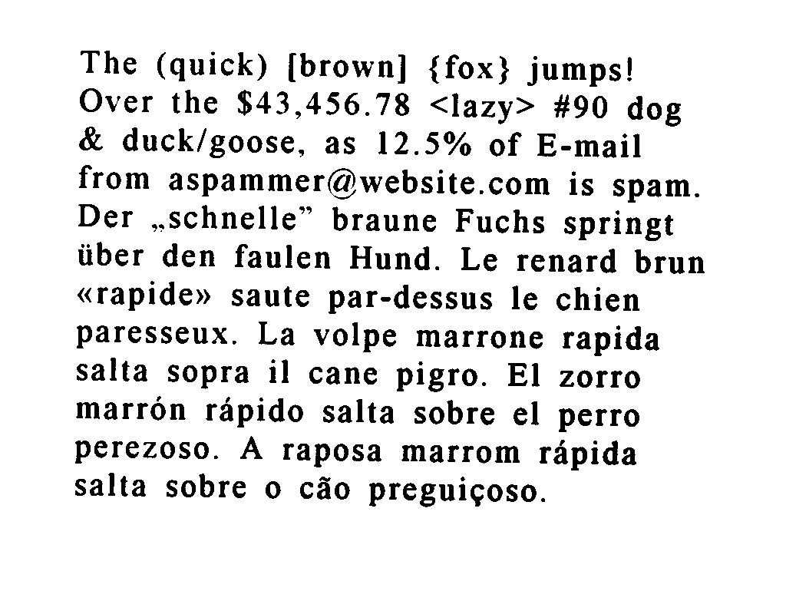
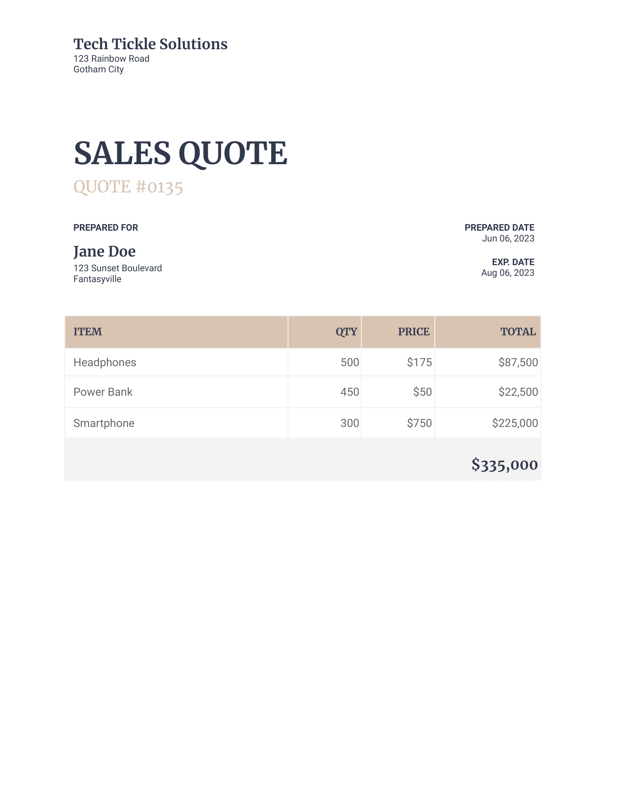

# OCR Overview
This is a simple OCR microservice written in Python using the [FastAPI](https://github.com/tiangolo/fastapi) framework and the [PyTesseract](https://github.com/madmaze/pytesseract) library, which is a wrapper for Google's [Tesseract OCR Engine](https://github.com/tesseract-ocr/tesseract).

## Examples
To give an idea of how the microservice works, practical examples are given below.

### Multilingual sample
This example shows how the microservice is able to recognize texts written in different languages in the same image.

The following is the outcome achieved with the given image.

      {
        "message": "The (quick) [brown] {fox} jumps!\nOver the $43,456.78 <lazy> #90 dog\n& duck/goose, as 12.5% of E-mail\nfrom aspammer@website.com is spam.\nDer ,.schnelle” braune Fuchs springt\niiber den faulen Hund. Le renard brun\n«rapide» saute par-dessus le chien\nparesseux. La volpe marrone rapida\nsalta sopra il cane pigro. El zorro\nmarron rapido salta sobre el perro\nperezoso. A raposa marrom rapida\nsalta sobre o céo preguicoso.\n\f"
      }

### Tabular sample
This example shows how the microservice is able to recognize text given in a table.

The following is the outcome achieved with the given image.

      {
        "message": "Tech Tickle Solutions\n\n123 Rainbow Road\nGotham City\n\nSALES QUOTE\n\nQUOTE #0135\n\nPREPARED FOR PREPARED DATE\nJun 06, 2023\n\nJane Doe\n\n123 Sunset Boulevard Aug 06, 2023\n\nFantasyville\n\nHeadphones $175 $87,500\n\nPower Bank 450 $50 $22,500\n\nSmartphone 300 $750 $225,000\n\n$335,000\n\f"
      }